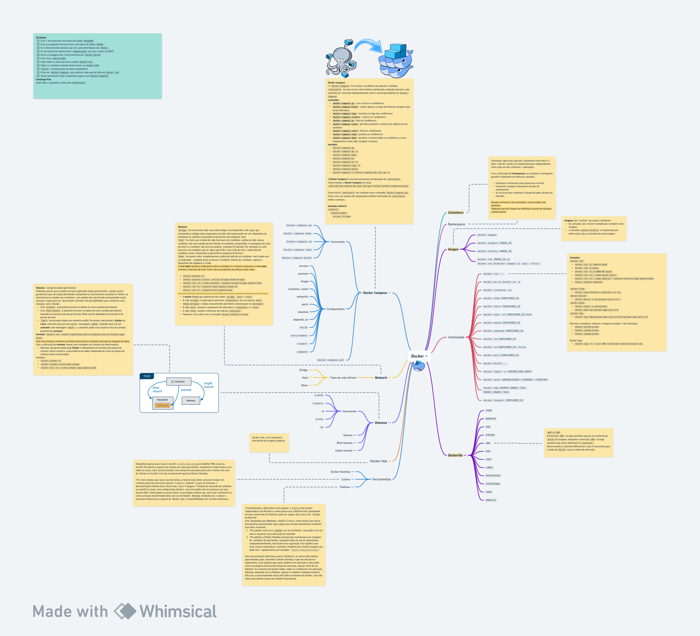

# Docker Summary with challenge practice
> Resumo de aprendizado Docker com desafio para praticar o aprendizado


Table of Contents
- [Docker Summary with challenge practice](#docker-summary-with-challenge-practice)
  - [Motivaçao](#motivaçao)
  - [Principais componentes](#principais-componentes)
    - [Dockerfile](#dockerfile)
  - [Docker Commands](#docker-commands)
    - [Images](#images)
    - [Containers](#containers)
    - [Namespace](#namespace)
    - [Volumes](#volumes)
    - [Network](#network)
    - [Docker Hub](#docker-hub)
    - [Docker Compose](#docker-compose)
  - [Ferramentas](#ferramentas)
    - [Docker Desktop](#docker-desktop)
    - [Podman](#podman)
    - [Colima](#colima)
  - [Desafio](#desafio)
  - [Referencias](#referencias)

## Motivaçao
Praticar os conceitos de Docker e Docker Compose.
Depois de tanto tempo trabalhando com Docker, resolvi estudar novamente fazendo anotações para documentar de forma publica e deixar aberto para a comunidade.



## Principais componentes

- Dockerfile
- Docker image
- Container 
- Namespace
- Network
- Volumes
- Docker Compose
- Docker Hub

### Dockerfile

> O Docker pode construir imagens automaticamente lendo as instruções de um `Dockerfile`. Um `Dockerfile` é um documento de texto que contém todos os comandos que um usuário pode chamar na linha de comando para montar uma imagem. 

**Configurações**

- `FROM`
- `WORKDIR`
- `ADD`
- `EXPOSE`
- `ARG`
- `ENV`
- `COPY`
- `LABEL`
- `ENTRYPOINT`
- `STOPSIGNAL`
- `USER`
- `ONBUILD` - (when combined with one of the supported instructions above)

> `ARG vs ENV`   
A instrução `ARG` carrega variáveis apenas no momento de build da imagem, enquanto a instrução `ENV` carrega variáveis que serão utilizadas no `container`.
Desta maneira, é possível diferenciar o que é necessário para a etapa de `build` e para a etapa de execução.

## Docker Commands

**docker run**
- `docker run -it ubuntu bash`
- `docker run -d nginx`
- `docker run -d -p 8080:80 nginx` 
- `docker run -it --name nginx nginx` 
- `docker run -it --name ubuntu1 --network minha-bridge ubuntu bash`
  
**docker inspect**
- `docker inspect ubuntu1`

**docker stop**
- `docker stop $(docker container ls -q)`
  
**docker build**  
- `docker build -t eprogramar/java:1.0 .`

**docker push**
- `docker login -ueprogramar`
- `docker push eprogramar/app-java:1.0`
  
**docker tag**
- `docker tag fabianogoes/app-java:1.0 eprogramar/app-java:1.0`

**Remover containers, volumes e imagens paradas / não utilizadas**                          
- `docker system prune`
- `docker volume prune`                          
- `docker imagem prune`

**docker logs**                          
- `docker logs -f --tail 100 [container-name/container-id]`

### Images
> imagens são “receitas” para gerar containers
As camadas são a menor unidade que compõem uma `imagem`.
o comando `docker history` é responsável por exibir quais são as camadas de uma `imagem`.

**Comandos para Docker Image**

- `docker images`
- `docker inspect IMAGE_ID`
- `docker history IMAGE_ID`
- `docker rmi IMAGE_ID` ou `docker rmi $(docker images ls -aq) --force`

### Containers
> `Containers` agem para garantir isolamento entre eles e o host, a fim de  manter os comportamentos independentes entre cada um dos sistemas e  aplicações. 
> Com a utilização de `Namespaces`, os containers conseguem garantir isolamento em diversas camadas.   
> Containers funcionam como processos no `host`.   
`Containers` atingem isolamento através de `namespaces`.   
Os recursos dos `containers` são gerenciados através de `cgroups`.   
> Quando `containers` são removidos, nossos dados são perdidos.   
> Podemos persistir dados em definitivo através de `volumes` e `bind mounts`;

### Namespace
> Com a utilização de `Namespaces`, os `containers` conseguem garantir isolamento em diversas camadas.


### Volumes
> `Volumes`:  são gerenciados pelo Docker.      
Podemos querer que os dados da nossa aplicação sejam persistentes, porque assim garantimos que ela esteja distribuída e disponível se  precisarmos consultá-la. Porém, se escrevermos os dados nos containers, por padrão eles não ficarão armazenados nesta camada, criada para ser descartável. Existem três possibilidades para contornar esta situação  com o Docker.   
> - Com `volumes`, é possível escrever os dados em uma camada persistente.   
> - Com `bind mounts`, é possível escrever os dados em uma camada persistente baseado na estrutura de pastas do host, `Bind mounts` dependem da estrutura de pastas do host.   
> - Com `Tmpfs` armazenam dados em memória volátil. Se estiver executando o Docker no Linux, você tem uma terceira opção:  montagens `tmpfs`. Quando você cria um container com montagem `tmpfs`, o  `container` pode criar arquivos fora da camada gravável do `container`.   


**exemplos de uso para Docker Volume**

- `docker run -–mount type=bind,source=/home/diretorio,target=/app nginx`   
Com esta sintaxe, criaremos um bind mount para o container baseado na imagem do nginx.   

Com a utilização de `volumes`, temos uma vantagem em relação aos `bind mounts`:
`Volumes` são gerenciados pelo `Docker` e independem da estrutura de pastas do sistema, Desta maneira, a persistência de dados independe de como as pastas do sistema estão estruturadas.

**exemplo**:
- `docker volume ls`
- `docker volume create meu-volume`
- `docker run -it -v meu-volume:/app ubuntu bash`


### Network
> A rede de `containers` refere-se à capacidade dos contêineres se conectarem e se comunicarem entre si ou com cargas de trabalho não `Docker`.
> `Bridge`: Em termos de rede, uma `rede bridge` é um dispositivo Link Layer que  encaminha o tráfego entre segmentos de rede. Uma ponte pode ser um  dispositivo de hardware ou software executado no kernel de uma máquina  host.   
> `Host`: Se você usar o modo de `rede host` para um `container`, a pilha de rede  desse `container` não será isolada do `host Docker` (o contêiner compartilha  o namespace de rede do host) e o container não terá seu próprio  endereço IP alocado.    > Por exemplo, se você executar um container que se liga à porta `80` e usar rede de `host`, o aplicativo do `container` estará  disponível na porta 80 no endereço `IP do host`.   
> `None`: Se quiser isolar completamente a pilha de rede de um `container`, você  pode usar o sinalizador `--network none` ao iniciar o contêiner. Dentro do  `container`, apenas o dispositivo de loopback é criado.   
> A `rede host` remove o isolamento entre o `container` e o sistema, enquanto a rede none remove a interface de rede. Estes são os propósitos de utilizar estas redes.

A `rede bridge` é usada para comunicar containers em um mesmo host.
`Redes bridges` criadas manualmente permitem comunicação via hostname.   
A `rede host` remove o isolamento de rede entre o container e o host.   
A `rede none` remove a interface de rede do container.   
Podemos criar redes com o comando `docker network create`

**exemplos de comandos para uso de Docker Netwotk**

- `docker network ls`
- `docker network create --driver bridge minha-bridge`
- `docker run -it --name ubuntu1 --network minha-bridge ubuntu bash`
- `docker run -d --network none ubuntu sleep 1d`
- `docker run -d --network host ubuntu bash`

O `docker` dispõe por padrão de três redes: 
- `bridge`
- `host`
- `none`

### Docker Hub
> `Docker Hub`: é um repositório distribuido de imagens publicas.   
> site: https://hub.docker.com/

### Docker Compose
> O `Docker Compose` resolve o problema de executar múltiplos containers  de uma só vez e de maneira coordenada, evitando executar cada comando de  execução individualmente. Este é o principal objetivo do `Docker Compose`. 

**Configurações para docker-compose**

arquivo: `docker-compose.yml`

- `version`
- `services`
- `image`
- `container_name`
- `networks`
- `ports`
- `volumes`
- `depends_on`
- `build`
- `environment`
- `restart`
- `command`

**Principais comandos para o Docker Compose**

- `docker-compose up`: cria e inicia os contêineres;
- `docker-compose build`: realiza apenas a etapa de build das imagens que serão utilizadas;
- `docker-compose logs`: visualiza os logs dos contêineres;
- `docker-compose restart`: reinicia os contêineres;
- `docker-compose ps`: lista os contêineres;
- `docker-compose scale`: permite aumentar o número de réplicas de um contêiner;
- `docker-compose start`: inicia os contêineres;
- `docker-compose stop`: paralisa os contêineres;
- `docker-compose down`: paralisa e remove todos os contêineres e seus componentes como rede, imagem e volume.
  
**Exemplos de comandos para docker-compose**

- `docker compose up`
- `docker-compose up -d`
- `docker-compose ps`
- `docker compose down`
- `docker-compose rm`
- `docker-compose rm -f`
- `docker-compose logs`
- `docker-compose build`
- `docker-compose logs -f`
- `docker-compose -f docker-compose-dev.yml up -d`

O `Docker Compose` é uma ferramenta de coordenação de `containers`;   
Como instalar o Docker Compose no Linux;
```shell
sudo apt-get update
sudo apt-get install docker-compose-plugin
```
Como iniciar containers em conjunto com o comando `docker-compose up`;
Como criar um arquivo de composição e definir instruções de `containers`, redes e serviços.

```yml
exemplo network:
network:
    minha-bridge:
        driver: bridge
```

## Ferramentas

- Docker Desktop 
- Podman
- Colima

### Docker Desktop
https://docs.docker.com/desktop/

> `Docker Desktop` é um aplicativo de instalação com um clique para seu ambiente Mac, Linux ou Windows que permite criar, compartilhar e executar aplicativos e microsserviços em contêineres. Ele fornece uma GUI (interface gráfica do usuário) simples que permite gerenciar seus contêineres, aplicativos e imagens diretamente de sua máquina.   
> O `Docker Desktop` pode ser usado sozinho ou como ferramenta complementar à CLI. O `Docker Desktop` reduz o tempo gasto em configurações complexas para que você possa se concentrar na escrita do código. 
> Ele cuida dos mapeamentos de portas, preocupações com o sistema de arquivos e outras configurações padrão, e é atualizado regularmente com correções de bugs e atualizações de segurança.

### Podman
https://podman.io/

> Provavelmente a alternativa mais popular, o `Podman` tem muitos colaboradores da Red Hat e, como parece que a Red Hat está  planejando versões comerciais do Podman, pode ser seguro dizer que é um  “projeto da Red Hat”.   
> Está  disponível para Windows, macOS e Linux e, como muitas das outras  ferramentas apresentadas aqui, segue uma sintaxe semelhante ao Docker  com duas ressalvas: 
> - Por padrão, você usa o `podman` em vez do Docker, mas pode criar um alias e esquecer essa alteração de comando.
> - Por padrão, o `Docker Desktop` assume que você deseja usar imagens de  container do hub Docker, enquanto todas as outras alternativas,  compreensivelmente, não fazem essa suposição. Isso significa que você  precisa especificar o caminho completo para muitas imagens que pode usar  regularmente, por exemplo, `docker.io/library/busybox`.
> Uma das principais diferenças entre o `Podman` e as outras alternativas  apresentadas aqui, incluindo o Docker Desktop, é que ele não possui daemonless.   
> Isso significa que cada container em execução é executado  como seu próprio processo de tempo de execução, não por meio de um  daemon.   
> Se o daemon do `Docker` falhar, todos os containers em execução falharão, enquanto com o `Podman`, apenas o container individual falhará.    
> Dito isso, eu pessoalmente nunca tive falha no daemon do `Docker`, mas não  estou executando cargas de trabalho de produção.


### Colima
https://github.com/abiosoft/colima

> Disponível apenas para Linux e macOS, o `Colima` usa Lima para habilitar VMs Linux no macOS. Ele oferece suporte aos tempos de  execução Docker, Containerd e Kubernetes e, em todos os casos, você  precisa instalar esse tempo de execução junto com o Colima. No caso do  Docker no macOS, isso não é exatamente igual ao `Docker Desktop`.
> Por mais simples que seja o uso do `Colima`, o fato de você ainda  precisar instalar um runtime junto com ele me fez pensar “o que é o `Colima`?” e, para ser honesto, a documentação mínima não o torna mais  claro. O slogan é “Tempos de execução do contêiner no macOS (e Linux)  com configuração mínima”, mas isso ainda não me esclarece por que  preciso dele.    
> Tanto quanto eu posso dizer, os principais motivos são  para usar containerd ou como um back-end do `Kubernetes` (em vez de Docker  Dkestop, minikube etc.) e talvez o principal motivo para o suporte do  Docker seja a compatibilidade com versões anteriores.

## Desafio

- [ ] Criar 1 microservice com banco de dados MongoDB.
- [ ] Criar um segundo microservices com banco de dados MySQL.
- [ ] Os 2 microservices devem usar um cache distribuido com Redis.
- [ ] Os microservices devem fazer comunicação um com o outro via REST.
- [ ] Gerar as imagens dos 2 microservices por docker build.
- [ ] Criar uma rede bridge.
- [ ] Subir todos os microservices usando docker run.
- [ ] Todos os containers devem devem estar na mesma rede.
- [ ] Testar a comunicação de toda a arquitetura.
- [ ] Criar um  Docker Compose para abstrair tudo que foi feito via docker run.
- [ ] Testar novamente toda a arquitetura agora com Docker Compose.

**Challenge Plus**
- [ ] Subir toda a arquitetura utilizando Kubernetes

## Referencias
- [Mind Map - whimsical](https://whimsical.com/docker-145EKpRVbf7JrQMKrkTKR4@7YNFXnKbZA9ici28hJ9RX)
- [Site Oficial Docker](https://www.docker.com/)
- [Dockerfile](https://docs.docker.com/engine/reference/builder/)
- [Docker Network](https://docs.docker.com/network/)
- [Docker Volumes](https://docs.docker.com/storage/volumes/)
- [Docker Compose](https://docs.docker.com/compose/)
- [Docker Hub](https://hub.docker.com/)
- [Docker Desktop](https://docs.docker.com/desktop/)
- [Podman](https://podman.io/)
- [Colima](https://github.com/abiosoft/colima)
